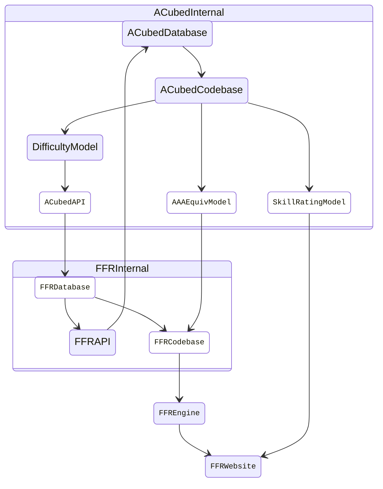

<!-- Improved compatibility of back to top link: See: https://github.com/othneildrew/Best-README-Template/pull/73 -->
<a name="readme-top"></a>
<!--
*** Thanks for checking out the Best-README-Template. If you have a suggestion
*** that would make this better, please fork the repo and create a pull request
*** or simply open an issue with the tag "enhancement".
*** Don't forget to give the project a star!
*** Thanks again! Now go create something AMAZING! :D
-->


<!-- PROJECT SHIELDS -->
<!--
*** I'm using markdown "reference style" links for readability.
*** Reference links are enclosed in brackets [ ] instead of parentheses ( ).
*** See the bottom of this document for the declaration of the reference variables
*** for contributors-url, forks-url, etc. This is an optional, concise syntax you may use.
*** https://www.markdownguide.org/basic-syntax/#reference-style-links
-->
[![Contributors][contributors-shield]][contributors-url]
[![Forks][forks-shield]][forks-url]
[![Stargazers][stars-shield]][stars-url]
[![Issues][issues-shield]][issues-url]
[![MIT License][license-shield]][license-url]
[![LinkedIn][linkedin-shield]][linkedin-url]


<!-- PROJECT LOGO -->
<br />
<div align="center">
  <a href="https://github.com/wirrywoo/ACubed">
    <picture>
        <source srcset="assets/logo/dark-mode.png"  media="(prefers-color-scheme: dark)">
        
    </picture>
  </a>

  <p align="center">
    A redesigned system to measure stepfile difficulty, compute AAA equivalency, and rank player's skill in <a href="https://www.flashflashrevolution.com/">FlashFlashRevolution</a> (FFR). 
<!--     <br />
    <a href="https://github.com/wirrywoo/cobe-platform/"><strong>Explore the docs »</strong></a>
    <br /> -->
    <br />
    <br />
<!--    <a href="https://www.youtube.com/watch?v=iHAt1286_4c">View Demo</a>
    ·
    <a href="https://devpost.com/software/containerized-online-bandit-experimentation-cobe-platform">View Devpost Submission</a>
    · -->
    <a href="https://github.com/wirrywoo/cobe-platform/issues">Report Bug</a>
    ·
    <a href="https://github.com/wirrywoo/cobe-platform/issues">Request Feature</a>
  </p>
</div>


<!-- TABLE OF CONTENTS -->
<details>
  <summary>Table of Contents</summary>
  <ol>
    <li>
      <a href="#about-the-project">About The Project</a>
      <ul>
        <li><a href="#built-with">Built With</a></li>
      </ul>
    </li>
    <li>
      <a href="#getting-started">Getting Started</a>
      <ul>
        <li><a href="#prerequisites">Prerequisites</a></li>
        <li><a href="#installation">Installation</a></li>
      </ul>
    </li>
    <li><a href="#usage">Usage</a></li>
    <li><a href="#roadmap">Roadmap</a></li>
    <li><a href="#contributing">Contributing</a></li>
    <li><a href="#license">License</a></li>
    <li><a href="#contact">Contact</a></li>
    <li><a href="#acknowledgments">Acknowledgments</a></li>
  </ol>
</details>


<!-- ABOUT THE PROJECT -->
## About The Project

ACubed is a collection of machine learning models aimed to standardize feature definitions, increase data scalability, and improve model interpretability for the popular music-based rhythm game FlashFlashRevolution. It proposes a time series extrinsic regression model using objectively defined time-sensitive features to predict stepfile difficulty, and utilizes expectation-maximization algorithm to design a model training framework that simultaneously learns AAA equivalency and skill rating for any given player.

Shown below is a high-level diagram that visualizes the proposed technical architecture of ACubed's integration with FFR's Codebase.



<p align="right">(<a href="#readme-top">back to top</a>)</p>


### Built With

* [![Python][python-shield]][python-url]
* [![Docker][docker-shield]][docker-url]
* [![Django][django-shield]][django-url]
* [![JQuery][jquery-shield]][jquery-url]
* [![Gunicorn][gunicorn-shield]][gunicorn-url]
* [![NGINX][nginx-shield]][nginx-url]
* [![VowpalWabbit][vw-shield]][vw-url]
* [![Weights and Biases][wandb-shield]][wandb-url]
* [![Ubuntu][ubuntu-shield]][ubuntu-url]
* [![Visual Studio Code][vscode-shield]][vscode-url]

<p align="right">(<a href="#readme-top">back to top</a>)</p>


<!-- GETTING STARTED -->
## Getting Started

This is an example of how you may give instructions on setting up your project locally.
To get a local copy up and running follow these simple example steps.

### Prerequisites

This project is developed on `Python 3.10.12` in `Ubuntu-22.04 (WSL)` via the default `bash` Linux shell. Further testing on codebase compatibility is needed. Make sure to test the project in different environments and report any issues you encounter.

Create `.env` file containing the following contents and add configuration file to project's root directory:

```
USERNAME=<insert FFR username>
MONGODB_KEY=<insert MongoDB secret key (contact WirryWoo)>
FFR_API_KEY=<insert FFR API secret key (contact Velocity)>
```

### Installation

1. Create virtual environment and install all necessary dependencies by running the following command:
    ```console
    foo@bar:/acubed$ make install
    ```
2. Run both FastAPI server and Streamlit web application by running the following command:
    ```console
    foo@bar:/acubed$ make start
    ```
3. Navigate to `http://localhost:8501/acubed` in the web browser to access the application.
4. In cases when a factory reset for the project is in need, run the following command and repeat steps 1 - 3. 
    ```console
    foo@bar:/acubed$ make uninstall
    ```


<p align="right">(<a href="#readme-top">back to top</a>)</p>


<!-- USAGE -->
## Usage

Use this space to show useful examples of how a project can be used. Additional screenshots, code examples and demos work well in this space. You may also link to more resources.

_For more examples, please refer to the [Documentation](https://example.com)_

<p align="right">(<a href="#readme-top">back to top</a>)</p>


<!-- ROADMAP -->
## Future State

- [ ] Feature 1
- [ ] Feature 2
- [ ] Feature 3
    - [ ] Nested Feature

See the [open issues](https://github.com/wirrywoo/cobe-platform/issues) for a full list of proposed features (and known issues).

<p align="right">(<a href="#readme-top">back to top</a>)</p>


<!-- CONTRIBUTING -->
## Contributing

Contributions are what make the open source community such an amazing place to learn, inspire, and create. Any contributions you make are **greatly appreciated**.

If you have a suggestion that would make this better, please fork the repo and create a pull request. You can also simply open an issue with the tag "enhancement".
Don't forget to give the project a star! Thanks again!

1. Fork the Project
2. Create your Feature Branch (`git checkout -b feature/AmazingFeature`)
3. Commit your Changes (`git commit -m 'Add some AmazingFeature'`)
4. Push to the Branch (`git push origin feature/AmazingFeature`)
5. Open a Pull Request

<p align="right">(<a href="#readme-top">back to top</a>)</p>


<!-- LICENSE -->
## License

Distributed under the MIT License. See `LICENSE.txt` for more information.

<p align="right">(<a href="#readme-top">back to top</a>)</p>


<!-- CONTACT -->
## Contact

Wilson Cheung - [Personal Website](https://wilsoncheung.me/) - info@wilsoncheung.me

Project Link: [https://github.com/wirrywoo/cobe-platform](https://github.com/wirrywoo/cobe-platform)

<p align="right">(<a href="#readme-top">back to top</a>)</p>


<!-- ACKNOWLEDGMENTS
## Acknowledgments

* []()
* []()
* []()

<p align="right">(<a href="#readme-top">back to top</a>)</p> -->


<!-- MARKDOWN LINKS & IMAGES -->
<!-- https://www.markdownguide.org/basic-syntax/#reference-style-links -->
[contributors-shield]: https://img.shields.io/github/contributors/wirrywoo/cobe-platform.svg
[contributors-url]: https://github.com/wirrywoo/cobe-platform/graphs/contributors
[forks-shield]: https://img.shields.io/github/forks/wirrywoo/cobe-platform.svg
[forks-url]: https://github.com/wirrywoo/cobe-platform/network/members
[stars-shield]: https://img.shields.io/github/stars/wirrywoo/cobe-platform.svg
[stars-url]: https://github.com/wirrywoo/cobe-platform/stargazers
[issues-shield]: https://img.shields.io/github/issues/wirrywoo/cobe-platform.svg
[issues-url]: https://github.com/wirrywoo/cobe-platform/issues
[license-shield]: https://img.shields.io/github/license/wirrywoo/cobe-platform
[license-url]: https://github.com/wirrywoo/cobe-platform/blob/main/LICENSE.txt
[linkedin-shield]: https://img.shields.io/badge/-LinkedIn-black.svg?logo=linkedin&colorB=555
[linkedin-url]: https://linkedin.com/in/wcheung-in/
[product-screenshot]: images/screenshot.png

[python-shield]: https://img.shields.io/badge/Python-3776AB.svg?style=for-the-badge&logo=Python&logoColor=white
[python-url]: https://www.python.org/
[jquery-shield]: https://img.shields.io/badge/jQuery-0769AD.svg?style=for-the-badge&logo=jQuery&logoColor=white
[Jquery-url]: https://jquery.com 
[django-shield]: https://img.shields.io/badge/Django-092E20.svg?style=for-the-badge&logo=Django&logoColor=white
[django-url]: https://www.djangoproject.com/
[gunicorn-shield]: https://img.shields.io/badge/Gunicorn-499848.svg?style=for-the-badge&logo=Gunicorn&logoColor=white
[gunicorn-url]: https://gunicorn.org/
[nginx-shield]: https://img.shields.io/badge/NGINX-009639.svg?style=for-the-badge&logo=NGINX&logoColor=white
[nginx-url]: https://www.nginx.com/
[vw-shield]: https://img.shields.io/badge/Vowpal%20Wabbit-FF81F9.svg?style=for-the-badge&logo=Vowpal-Wabbit&logoColor=black
[vw-url]: https://vowpalwabbit.org/
[wandb-shield]: https://img.shields.io/badge/Weights%20&%20Biases-FFBE00.svg?style=for-the-badge&logo=weightsandbiases&logoColor=black
[wandb-url]: https://wandb.ai/
[docker-shield]: https://img.shields.io/badge/Docker-2496ED.svg?style=for-the-badge&logo=Docker&logoColor=white
[docker-url]: https://www.docker.com/
[ubuntu-shield]: https://img.shields.io/badge/Ubuntu-E95420.svg?style=for-the-badge&logo=Ubuntu&logoColor=white
[ubuntu-url]: https://ubuntu.com/
[vscode-shield]: https://img.shields.io/badge/Visual%20Studio%20Code-007ACC.svg?style=for-the-badge&logo=Visual-Studio-Code&logoColor=white
[vscode-url]: https://code.visualstudio.com/

