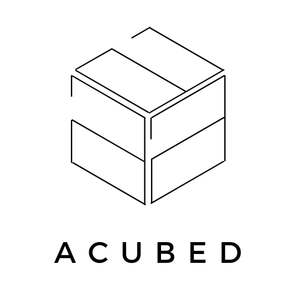
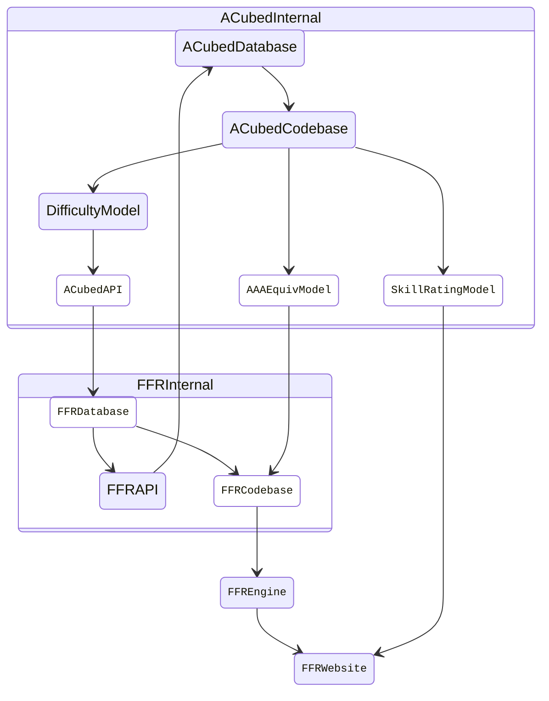

<!-- Improved compatibility of back to top link: See: https://github.com/othneildrew/Best-README-Template/pull/73 -->
<a name="readme-top"></a>
<!--
*** Thanks for checking out the Best-README-Template. If you have a suggestion
*** that would make this better, please fork the repo and create a pull request
*** or simply open an issue with the tag "enhancement".
*** Don't forget to give the project a star!
*** Thanks again! Now go create something AMAZING! :D
-->


<!-- PROJECT SHIELDS -->
<!--
*** I'm using markdown "reference style" links for readability.
*** Reference links are enclosed in brackets [ ] instead of parentheses ( ).
*** See the bottom of this document for the declaration of the reference variables
*** for contributors-url, forks-url, etc. This is an optional, concise syntax you may use.
*** https://www.markdownguide.org/basic-syntax/#reference-style-links
-->
<div align="center">

[![Contributors][contributors-shield]][contributors-url]
[![Forks][forks-shield]][forks-url]
[![Stargazers][stars-shield]][stars-url]
[![Issues][issues-shield]][issues-url]

</div>


<!-- PROJECT LOGO -->
<br />
<div align="center">
  <a href="https://github.com/wirrywoo/ACubed">
    <picture>
        <source srcset="assets/logo/dark-mode.png"  media="(prefers-color-scheme: dark)">
        
    </picture>
  </a>
  <br />
  <br />
  <p align="center">
    A redesigned system to measure stepfile difficulty, compute AAA equivalency, and rank player's skill in <a href="https://www.flashflashrevolution.com/">FlashFlashRevolution</a> (FFR). 
<!--     <br />
    <a href="https://github.com/wirrywoo/acubed/"><strong>Explore the docs »</strong></a>
    <br /> -->
    <br />
    <br />
<!--    <a href="https://www.youtube.com/watch?v=iHAt1286_4c">View Demo</a>
    ·
    · -->
    <a href="https://github.com/wirrywoo/acubed/issues"></a>
    <a href="https://github.com/wirrywoo/acubed/issues"></a>
  </p>
</div>


<!-- ABOUT THE PROJECT -->
## About The Project

ACubed is a collection of machine learning models aimed to standardize feature definitions, increase data scalability, and improve model interpretability for the popular music-based rhythm game FlashFlashRevolution. It proposes a time series extrinsic regression model using objectively defined time-sensitive features to predict stepfile difficulty, and utilizes expectation-maximization algorithm to design a model training framework that simultaneously learns AAA equivalency and skill rating for any given player.

Shown below is a high-level diagram that visualizes the proposed technical architecture of ACubed's integration with FFR's Codebase.




### Technology Stack

<a href="https://www.docker.com/"></a>&emsp;<a href="https://www.dotenv.org/"></a>&emsp;<a href="https://fastapi.tiangolo.com/"></a>&emsp;<a href="https://git-scm.com/"></a>&emsp;<a href="https://github.com/features/actions"></a>&emsp;<a href="https://www.gnu.org/software/bash/"></a>&emsp;<a href="https://www.mongodb.com/"></a>&emsp;<a href="https://numpy.org/"></a>&emsp;<a href="https://onnx.ai/"></a>&emsp;<a href="https://www.overleaf.com/"></a>&emsp;<a href="https://pola.rs/"></a>&emsp;<a href="https://www.python.org/"></a>&emsp;<a href="https://www.ray.io/"></a>&emsp;<a href="https://scikit-learn.org/stable/index.html"></a>&emsp;<a href="https://streamlit.io/"></a>&emsp;<a href="https://ubuntu.com/"></a>&emsp;<a href="https://wandb.ai/site"></a>


<!-- GETTING STARTED -->
## Getting Started

### Prerequisites

This project is developed on `Python 3.10.12` in `Ubuntu-22.04 (WSL)` via the default `bash` Linux shell. Further testing on codebase compatibility across different environment versions is needed. Please report any issues you may encounter.

Create `.env` file using `.env.example` as a template and save this file in the project's root directory.

### Installation

1. Create virtual environment and install all necessary dependencies by running the following command:
    ```console
    foo@bar:/acubed$ make install
    PIPENV_VENV_IN_PROJECT=1 pipenv install -d
    Loading .env environment variables...
    Creating a virtualenv for this project...

    ...
    
    ✔ Successfully created virtual environment!
    Virtualenv location: /acubed/.venv
    Pipfile.lock not found, creating...

    ...

    Updated Pipfile.lock (...)!
    To activate this project's virtualenv, run pipenv shell.
    Alternatively, run a command inside the virtualenv with pipenv run.
    Installing dependencies from Pipfile.lock (...)...
    ```
2. Run both FastAPI server and Streamlit web application by running the following command:
    ```console
    foo@bar:/acubed$ make start
    Loading .env environment variables...
    INFO     Using path api/server.py
    INFO     Resolved absolute path /acubed/api/server.py
    INFO     Searching for package file structure from directories with __init__.py files
    INFO     Importing from /acubed/api

    ...
  
    INFO     Importing module server
  
    You can now view your Streamlit app in your browser.
  
    URL: http://localhost:8501/acubed

    ...
    ```
3. Navigate to `http://localhost:8501/acubed` in the web browser to access the application.
4. In cases when a factory reset for the project is in need, run the following command and repeat steps 1 - 3. 
    ```console
    foo@bar:/acubed$ make uninstall
    pipenv --rm
    Loading .env environment variables...
    Removing virtualenv (/acubed/.venv)...
    find . -type f -name "*.py[co]" -delete
    find . -type d -name "__pycache__" -delete
    find . -type d -name '*.egg-info' -exec rm -r {} +
    find . -type f -name "*.lock" -delete
    ```


<!-- USAGE -->
## Usage

Use this space to show useful examples of how a project can be used. Additional screenshots, code examples and demos work well in this space. You may also link to more resources.

_For more examples, please refer to the [Documentation](https://example.com)_

<p align="right">(<a href="#readme-top">back to top</a>)</p>


<!-- ROADMAP -->
## Future State

- [ ] Feature 1
- [ ] Feature 2
- [ ] Feature 3
    - [ ] Nested Feature

See the [open issues](https://github.com/wirrywoo/acubed/issues) for a full list of proposed features (and known issues).


<!-- CONTRIBUTING -->
## Contributing

Contributions are what make the open source community such an amazing place to learn, inspire, and create. Any contributions you make are **greatly appreciated**.

If you have a suggestion that would make this better, please fork the repo and create a pull request. You can also simply open an issue with the tag "enhancement".
Don't forget to give the project a star! Thanks again!

1. Fork the Project
2. Create your Feature Branch (`git checkout -b feature/AmazingFeature`)
3. Commit your Changes (`git commit -m 'Add some AmazingFeature'`)
4. Push to the Branch (`git push origin feature/AmazingFeature`)
5. Open a Pull Request


<!-- LICENSE -->
## License
[![MIT License][license-shield]][license-url]


<!-- CONTACT -->
## Contact

<!--
[![LinkedIn][linkedin-shield]][linkedin-url]
-->

<a href = "https://wilsoncheung.me/"></a>&emsp;<a href="https://linkedin.com/in/wcheung-in/"></a>&emsp;<a href="https://github.com/wirrywoo/"></a>&emsp;<a href="mailto:info@wilsoncheung.me?subject=[ACubed]"></a>

<p align="right">

  [🔼 Back to top](#readme-top)

</p>


<!-- ACKNOWLEDGMENTS
## Acknowledgments

* []()
* []()
* []()

<p align="right">(<a href="#readme-top">back to top</a>)</p> -->


<!-- MARKDOWN LINKS & IMAGES -->
<!-- https://www.markdownguide.org/basic-syntax/#reference-style-links -->
[contributors-shield]: https://img.shields.io/github/contributors/wirrywoo/acubed.svg?colorA=363a4f&colorB=1f77b4&style=for-the-badge
[contributors-url]: https://github.com/wirrywoo/acubed/graphs/contributors
[forks-shield]: https://img.shields.io/github/forks/wirrywoo/acubed.svg?colorA=363a4f&colorB=ff7f0e&style=for-the-badge
[forks-url]: https://github.com/wirrywoo/acubed/network/members
[stars-shield]: https://img.shields.io/github/stars/wirrywoo/acubed.svg?colorA=363a4f&colorB=2ca02c&style=for-the-badge
[stars-url]: https://github.com/wirrywoo/acubed/stargazers
[issues-shield]: https://img.shields.io/github/issues/wirrywoo/acubed.svg?colorA=363a4f&colorB=d62728&style=for-the-badge
[issues-url]: https://github.com/wirrywoo/acubed/issues
[license-shield]: https://img.shields.io/github/license/wirrywoo/acubed?colorA=363a4f&colorB=9467bd&style=for-the-badge
[license-url]: https://github.com/wirrywoo/acubed/blob/main/LICENSE.txt
[linkedin-shield]: https://img.shields.io/badge/-LinkedIn-black.svg?logo=linkedin&logoColor=white?colorA=363a4f&colorB=0A66C2&style=for-the-badge
[linkedin-url]: https://linkedin.com/in/wcheung-in/
[product-screenshot]: images/screenshot.png
